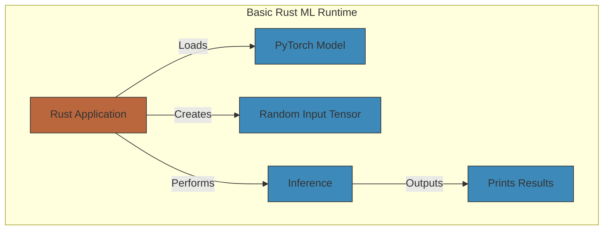

# /basic/basic.md
## Basic ML Runtime in Rust



### Key Considerations :pen:

*  __Device Handling__: Automatically uses CUDA if available.
*  __Model Definition__: Simple sequential model with one linear layer.
*  __Inference__: Forward pass through the model
*  __Tensor Operations__: Basic tensor creation and manipulation.


### Deployment Instructions (k3s) :cloud:

> __Build and Push Docker Image__

```sh
# Build
docker build -t your-registry/ml-runtime:latest .

# Push to registry
docker push your-registry/ml-runtime:latest

```

> Apply Kubernetes Configs

```sh
# Create namespace (optional)
kubectl create namespace ml-runtime

# Apply configs
kubectl apply -f pvc.yaml
kubectl apply -f deployment.yaml
kubectl apply -f service.yaml
kubectl apply -f ingress.yaml  # If using ingress

```

> Verify Deployment

```sh
# Check pods
kubectl get pods -n ml-runtime

# Check logs
kubectl logs -l app=ml-runtime -n ml-runtime

# Port-forward for testing
kubectl port-forward svc/ml-runtime 8080:80

```

> Update Deployment for GPU

```yaml
# In deployment.yaml, add:
resources:
  limits:
    nvidia.com/gpu: 1  # Request 1 GPU

```

> Install NVIDIA Device Plugin (k3s)

```sh
kubectl apply -f https://raw.githubusercontent.com/NVIDIA/k8s-device-plugin/v0.14.1/nvidia-device-plugin.yml

```


