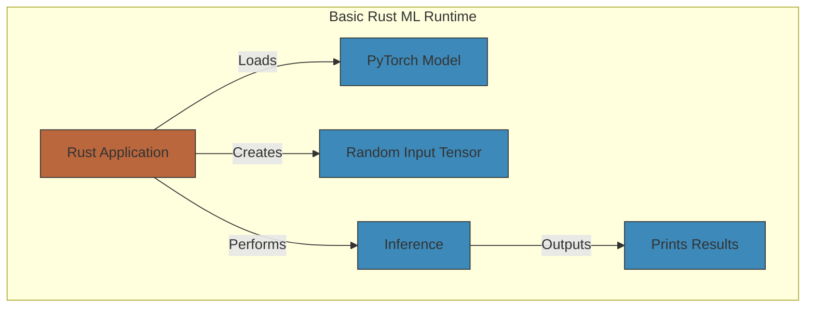

# /basic/basic.md
## Basic ML Runtime in Rust

### Key Considerations :pen:

*  __Device Handling__: Automatically uses CUDA if available.
*  __Model Definition__: Simple sequential model with one linear layer.
*  __Inference__: Forward pass through the model
*  __Tensor Operations__: Basic tensor creation and manipulation.

### How to use this :rescue_worker_helmet:

-  Replace the model definition with your actual model architecture
-  Uncomment and use the **vs.load** line to load your pre-trained weights.
-  Adjust input dimensions to match your model's expected input.

